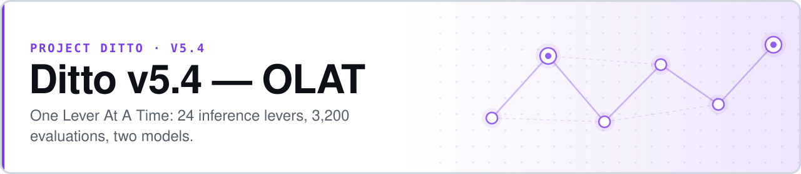

<p align="center">
  <picture>
    <source media="(prefers-color-scheme: dark)" srcset="assets/banner-dark.svg">
    
  </picture>
</p>

# Ditto v5.4 — OLAT (One Lever At A Time)

**If the inference regime matters more than the model, changing one lever at a time should show it.**

OLAT is a pre-registered study of how **24 prompting and inference levers** affect a model's ability to detect rule violations in Pokémon battle chains. Every lever is varied independently against the same 50-chain set, so an effect can be attributed to the lever rather than to a bundle of simultaneous changes. 3,200 evaluations across two DeepSeek V4 models.

- **One lever at a time, against a fixed chain set** — the whole point of the design, and the reason the effects are attributable
- **Three ground-truth universes** — the same chains labelled three different ways, so a finding that only holds under one labelling is visible as such
- **Six sensitivity analyses per condition** — a "Meaningful" result that collapses under sensitivity is flagged, not reported flat
- **SPEC locked by hash** — deviations live in dated amendments, never in edits to the spec


**[SPEC](pre-registration/SPEC.md)** · **[Day 2 summary](pre-registration/day_2/day_2_summary.md)** · **[Bonus analysis](pre-registration/bonus_analysis/bonus.md)** · **[Amendment 7](pre-registration/amendments/amendment_7.md)** · **[Build plan](pre-registration/BUILD_PLAN.md)**

**SPEC hash (locked, Amendment #6):** `dbae94dba3ee39d67b131639ae626b1afa7f14645008d37aa0bb464e91980fc8`

```bash
python3 pre-registration/scripts/day1_executor.py --dry-run   # pre-flight + cost estimate
python3 pre-registration/scripts/day2_analysis.py             # rebuild Day 2 effect tables
```

## Study design

Each model is evaluated on 50 chains sampled with `seed=42` from a pool of 19,428. For each of 24 levers, one or more levels (L1–L5) runs against that same chain set. Ground truth is assessed under three universes:

| Universe | Definition | Intact / violated (n=50) |
|---|---|---|
| **L1** — shuffled vs real | Was the chain shuffled? | 16 / 34 |
| **L2** — planted violations | Does the chain contain a planted rule violation? | 16 / 34 |
| **L3** — symbolic checker | Does a symbolic rule checker flag a violation? | 18 / 32 |

For this 50-chain draw, L1 and L2 are identical — every chain labelled violated in L1 is also violated in L2 — so the effective number of independent universes is **2, not 3.** That is a property of the draw and is reported rather than glossed.

Detection rate `dr = P(YES | chain)`. Gap convention (Convention B):

```
gap          = dr_violated − dr_intact          # TPR − FPR, both inside the condition
effect_size  = gap(condition) − gap(baseline)
```

| \|effect_size\| | Label |
|---|---|
| ≥ 0.10 | Meaningful |
| 0.03 – 0.10 | Directional |
| < 0.03 | Null |

If the 95% BCa bootstrap CI crosses zero, the label is downgraded one level.

## Headline findings

### Six meaningful conditions (Universe L3, primary)

| Condition | Effect | 95% CI | Meaningful in |
|---|---:|---|---|
| `pro_L18_L2` | 0.379 | [0.036, 0.745] | L3 only |
| `pro_L18_L3` | 0.354 | [0.026, 0.685] | all 3 |
| `pro_L17_L2` | 0.288 | [0.051, 0.486] | all 3 — most robust |
| `pro_L17_L3` | 0.243 | [0.010, 0.510] | all 3 — CI boundary-sensitive |
| `flash_L18_L2` | 0.217 | [0.026, 0.500] | L3 only |
| `pro_L12_L3` | 0.191 | [0.017, 0.438] | L3 only |

### The reasoning-depth valley

Token-quartile analysis (which supersedes the Day 2 S6 character-length analysis) shows both V4 models following a **valley-then-peak** pattern on L18 L3. At intermediate response lengths, partial chain-of-thought is *worse than baseline*: intact chains over-trigger YES relative to violated ones.

| Model | Valley range | Effect in valley | Escape |
|---|---|---|---|
| V4-Pro | 427–487 tokens | ≈ −0.36, CI [−0.78, −0.06] | ~494 tokens |
| V4-Flash | 606–728 tokens | ≈ −0.14, CI touches 0 | ~729 tokens |

**This is a design constraint, not a curiosity.** Any configuration that caps CoT generation inside the valley range will perform *worse* on rule-violation detection than one that does no reasoning at all.

## Amendment #7 — the L18 L4 retest

The original L18 L4 (native thinking) run at `max_tokens=64` produced 100/100 `Unknown`. Root cause: DeepSeek applies `max_tokens` to **total** output — `reasoning_content` + `content` — not to content only, as the SPEC assumed. The entire 64-token budget was consumed by reasoning before any verdict could be emitted.

Amendment #7 retested at `max_tokens=4096`, all other parameters unchanged (100 calls, ~$4.10).

**Result: Null in all three universes, for both models**, with `dr_violated = dr_intact = 1.0` on parseable records. **73 of 73 parseable verdicts are YES; zero are NO.** That is a YES-bias under native thinking, not a detection capability. 27% of records truncated at 4096 tokens (Flash 24%, Pro 30%), and intact chains truncate at 33% against 19–28% for violated — hinting at asymmetric reasoning cost.

The retest is written to `pre-registration/amendment_7/` as a **parallel product**. It is not merged into the primary effect tables without both-author sign-off. See the [summary](pre-registration/amendment_7/summary.md) and the [truncation breakdown](pre-registration/amendment_7/truncation_breakdown.md).

## Bonus analysis

A post-primary observational battery of 10 pre-specified tests, at **zero API cost** — every finding comes from records already on disk. 9 of 10 complete; Test 10 (composition sensitivity) is blocked on a missing pool file (`phase3_results_v4.csv`), and Test 5 (topic modelling) returned a null.

| Finding | Source |
|---|---|
| All 50 OLAT chains are exactly 15 steps — chain-length stratification is degenerate | Test 3 |
| 31 of 32 violated chains are blind spots for both models (< 40% DR across all conditions) | Test 3 |
| Symbolic checker: precision 1.0, recall 0.941 on the OLAT subset | Tests 8, 9 |
| The checker covers 94.7% of LLM failures; the LLM covers only 18.3% of checker failures | Test 9 |
| Random-forest predictor: 84.7% accuracy, AUC 0.925 — top feature is lever choice | Test 6 |
| L18 L4 (native thinking) returns YES on 100% of parseable records — no specificity | Tests 1, 2 |
| Deeper reasoning (3.7× longer) does not improve accuracy over L18 L3 | Test 2 |
| No chain exceeds a 0.30 YES rate across all 64 conditions — a strong NO-bias floor | Test 7 |

**Architectural implication.** A checker-primary, LLM-secondary ensemble under L18-class conditions beats either component alone. The bottleneck is **representational** — the chain format lacks the pattern-matching hooks an LLM needs — not a matter of reasoning depth. Condition choice matters more than chain properties.

Full write-ups: [`bonus.md`](pre-registration/bonus_analysis/bonus.md) · [`bonus_analysis_synthesis.md`](pre-registration/bonus_analysis/bonus_analysis_synthesis.md)

## Methodology

- **Parser** — 4-stage cascade over the model's `content` field: strict → permissive → md_strip → last_token. `reasoning_content` is preserved but never parsed (SPEC §8, Amendment #3).
- **Bootstrap** — BCa, 10,000 iterations, jackknife acceleration. Seeds 42 (Flash), 43 (Pro).
- **Six sensitivity analyses per condition** (SPEC §9.2) — S1 unparseables-as-NO; S2 unparseables-as-random; S3 arcsine-transformed gap; S4 parser-strict subset; S5 parse-failure audit (flagged at ≥ 10%); S6 response-length quartile, now token-based.
- **Robustness flags** — `robustness_concern` when a Meaningful primary has ≥ 3/6 sensitivities Null; `hidden_signal_candidate` when a Null primary has ≥ 3/6 sensitivities Meaningful.
- **Empirical Bayes shrinkage** — prior mean 0, prior variance = median observed bootstrap variance across levers.

## Status

| Phase | Status |
|---|---|
| Day −3 chain pool generation | Complete |
| Day −2 ground-truth verification (Flash, Pro) | Complete |
| Day 1 executor — 3,200 evaluations | Complete |
| Day 2 analysis — effect tables, sensitivities, EB shrinkage, deltas | Complete |
| Day 2 post-validation (6 tasks) | Complete |
| Quartile analysis (token-based) | Complete |
| Amendment #7 pilots + full retest | Complete |
| Amendment #7B — subset retest at 8192 | Pending decision |
| Bonus analysis battery | Complete (9/10; Test 10 blocked) |
| Both-author sign-off | Pending |

All scripts are append-only with resume support, keyed on `(condition_id, sample_id)` in `parser_provenance.ndjson`.

## Reproducing

```bash
# Requires DEEPSEEK_API_KEY in ../.env (resolved by the scripts at runtime)
python3 pre-registration/scripts/day1_executor.py --dry-run    # pre-flight + cost estimate
python3 pre-registration/scripts/day1_executor.py              # full Day 1 run
python3 pre-registration/scripts/day2_analysis.py              # rebuild Day 2 effect tables
python3 pre-registration/scripts/quartile_analysis.py          # token-quartile breakdown
```

## Pre-registration provenance

This study was pre-registered before any data collection, and the SPEC has been locked since Amendment #6 (hash `dbae94d…`). Every deviation is recorded in `pre-registration/amendments/`. The Amendment #7 retest is the only post-Day-1 methodology change; all other Day 2 outputs use the original locked SPEC.

## The Ditto program

| Version | Domain | Headline |
|---|---|---|
| [v1](https://github.com/safiqsindha/Project-Ditto) | Pokémon Showdown telemetry | Sonnet +0.206 · Haiku +0.066 |
| [v2](https://github.com/safiqsindha/Project-Ditto-v2) | Programming agent trajectories | Partial reproduction |
| [v3](https://github.com/safiqsindha/Project-Ditto-V3) | Chess · Chess960 · checkers · draughts | Phase 1 complete, paused at Gate 8 |
| [v4](https://github.com/safiqsindha/Project-Ditto-V4) | Pokémon, as a methodology control | +0.131, strong-positive |
| [v4.5](https://github.com/safiqsindha/Ditto-V4.5--DeepSeek-Flash-test) | DeepSeek V4 Flash cross-model probe | Scoping stub |
| [v5](https://github.com/safiqsindha/Ditto-V5) | PUBG · NBA · CS:GO · Rocket League · poker | 4-tier hierarchy, closed |
| [v5.1](https://github.com/safiqsindha/Ditto-5.1) | 22-model cross-provider panel | Near-chance across the panel |
| [v5.2](https://github.com/safiqsindha/Ditto-5.2-diagostic) | Diagnostic kit for the v5.1 null | Pre-registered, in progress |
| **v5.4** ⟵ *you are here* | **24 inference levers, two DeepSeek models** | **6 meaningful conditions** |

## License

Research artifacts; no commercial license is declared. Contact the repository owner for use beyond academic citation.
